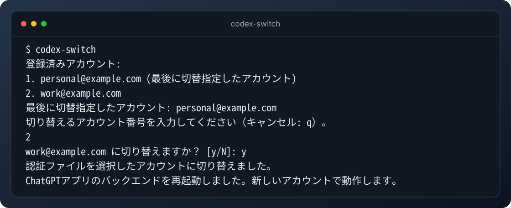

# codex-account-switcher

macOS で Codex のアカウントを切り替える非公式 CLI です。
認証情報を Mac の Keychain に保存し、ターミナルから切り替え先を選べます。
設定やローカルの履歴は、共通の `~/.codex` を使い続けます。



架空のアカウントを使った表示例です。実行中のタスクが完了してから切り替えます。成功後は起動中のアプリバックエンドへ自動で再読み込みを要求し、アプリ本体の再起動は不要です。

macOS 14 以降向けに、Apple Silicon・Intel 用の試用版を配布しています。
確認済みの環境と未確認の項目は [v0.1.0 のリリース説明](https://github.com/ml0-1337/codex-account-switcher/releases/tag/v0.1.0) を参照してください。

## インストール

```sh
brew install ml0-1337/tap/codex-switch
```

Swift の開発環境は不要です。直接ダウンロードやソースからのビルドは、[その他の導入方法](docs/installation.md)を参照してください。

配布バイナリは ad-hoc 署名済みですが、Developer ID 署名・Apple の公証はありません。
macOS が起動時に警告やブロックを表示する場合があります。

## 使い方

通常のターミナルで操作します。アカウントを登録済みなら、[切り替え](#アカウントを切り替える)へ進めます。

### 最初のアカウントを登録する

初回登録とアカウント追加には、公式デスクトップアプリが必要です。
現在のアカウントでログインし、`~/.codex/auth.json` があることを確認してください。

`~/.codex/config.toml` のトップレベルに、次の設定を入れます。
同じキーがあれば編集し、重複させないでください。`[mcp_servers.…]` などのテーブル内には追加しません。

```toml
cli_auth_credentials_store = "file"
```

現在のアカウントを保存します。

```sh
codex-switch setup
```

確認に `y` と答えると、認証情報を Keychain に保存します。
macOS のアクセス確認が出た場合は、このツールの項目であることを確認して許可してください。
登録済みの場合、この手順は不要です。

### 別のアカウントを追加する

```sh
codex-switch add
```

確認に `y` と答え、表示された URL とコードを使って別のアカウントでブラウザーログインします。
追加が完了しても、現在のアカウントは切り替わりません。

### アカウントを切り替える

**実行中の Codex タスクがすべて完了してから**実行してください。

```sh
codex-switch
```

一覧から切り替え先の番号を選び、確認に `y` と答えます。以下は架空のアカウントを使った表示例です。

```text
$ codex-switch
登録済みアカウント:
1. personal@example.com (最後に切替指定したアカウント)
2. work@example.com
最後に切替指定したアカウント: personal@example.com
切り替えるアカウント番号を入力してください（キャンセル: q）。
2
work@example.com に切り替えますか？ [y/N]: y
認証ファイルを選択したアカウントに切り替えました。
ChatGPTアプリのバックエンドを再起動しました。新しいアカウントで動作します。
```

成功後は、公式アプリのアカウント表示を確認してください。バックエンドを検出・再起動
できなかった場合は手動での再起動を案内する表示に変わります。
番号の入力で `q` を選ぶとキャンセルできます。

## その他の操作

| 操作 | コマンド |
| --- | --- |
| 登録したアカウントの一覧 | `codex-switch list` |
| ヘルプ | `codex-switch help` |
| 新しいバージョンへの更新 | `brew upgrade ml0-1337/tap/codex-switch` |
| アンインストール | `brew uninstall ml0-1337/tap/codex-switch` |

アンインストール後も、登録情報・Keychain・認証ファイル・設定・履歴は残ります。

操作に失敗して `recover` を案内された場合は、[復旧手順](docs/reference.md#recover)を確認してください。

## 詳細資料

- [その他の導入方法](docs/installation.md)
- [コマンドの仕様・データの保存先・復旧](docs/reference.md)
- [開発・配布の手順](docs/distribution.md)
- [実機での確認手順](docs/manual-acceptance.md)

## ライセンス

[MIT License](LICENSE)
